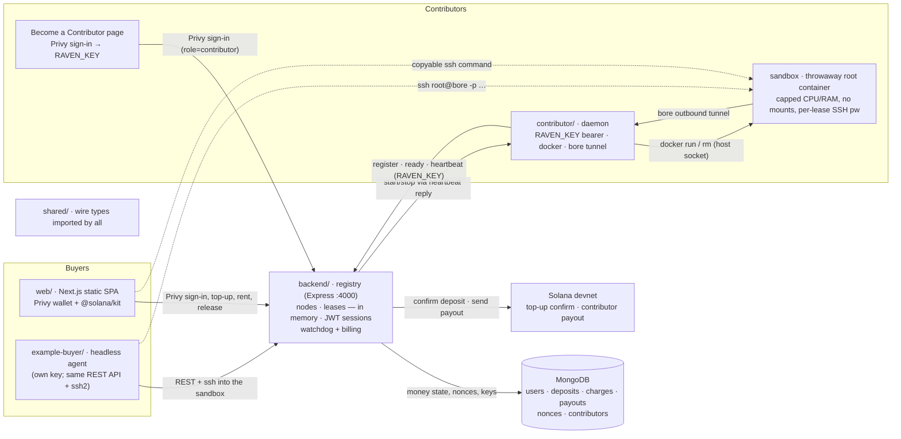

# RAVEN

Rent someone else's machine. Pay by the second, in SOL.

A contributor shares a real machine; a buyer (a human in the web app, or an autonomous agent) rents
it, gets an `ssh` command into a hardened throwaway container, and is billed for the exact seconds
used. Solana devnet, custodial balances, no on-chain program required.

## Architecture



**Pieces** — each is a `cd`-able folder; `shared/` holds the types they all import.

| Folder | What it is |
|---|---|
| `backend/` | The registry: REST API, wallet sign-in + JWT sessions, deposit/payout on Solana, contributor-key onboarding, lease lifecycle + billing watchdog. Nodes and leases live in memory; MongoDB holds money state, nonces, and contributor keys. |
| `contributor/` | Runs on each shared machine. Authenticates with a `RAVEN_KEY` bearer only — no wallet, no keypair — and on command launches a sandbox as a sibling container on the host Docker daemon, over a bore tunnel. |
| `web/` | Next.js App Router static SPA. Both roles authenticate through Privy (Solana): a Buyer dashboard (`/`) and a "Become a Contributor" page (`/contributor`). |
| `example-buyer/` | The buyer flow with no human: an agent that holds its own key, signs in, tops up, rents the cheapest node, SSHes in to run a job, then releases. |

**Auth (both roles, same flow)**
1. Connect Wallet via Privy (Phantom / Solflare / embedded / social — Solana only).
2. `GET /auth/nonce?address=<pubkey>` → single-use nonce (stored in Mongo, 5-min TTL).
3. Sign `Sign in to RAVEN: <nonce>` via Privy `signMessage`.
4. `POST /auth/verify {address, signature, role}` → backend verifies with tweetnacl, mints a **JWT** (`SESSION_SECRET`, 24h). Role is which page you started from — no separate auth.
- **Buyer:** the JWT authorizes `/wallet/topup` (buyer signs a real SOL transfer to `PLATFORM_PAYTO` in-browser via Privy; backend confirms on-chain and credits their balance) and `/leases` (spends balance, no further signing).
- **Contributor:** verify mints an opaque `rvn_ctb_…` key tied to the verified address in the `contributors` collection; the page shows it plus a one-line `docker run`. The daemon sends only that key as a bearer — the backend resolves it to the payout address server-side, used solely to send the on-chain payout at lease end via `PLATFORM_PRIVATE_KEY`.

**Lease flow**
- **Top up** — Privy sends SOL to `PLATFORM_PAYTO`; registry confirms the tx on-chain (depositor signed, lamports landed) and credits MongoDB, idempotent by signature.
- **Rent** — `POST /leases` queues a `start` command; the contributor's next heartbeat picks it up, runs the container + bore tunnel, posts `ready`; the lease goes `active` with an `ssh` command.
- **Release / exhaust** — registry bills the exact seconds used (charge in MongoDB), pays the contributor on-chain, and sends a `stop` command that destroys the container.

## Run it

```bash
cp .env.example .env               # MONGODB_URI, PLATFORM_PAYTO, PLATFORM_PRIVATE_KEY, SESSION_SECRET
npm install

npm run backend                    # 1. the registry            → :4000

# 2. web UI                                                     → http://localhost:3000
cp web/.env.example web/.env       # set NEXT_PUBLIC_PRIVY_APP_ID (Solana app from dashboard.privy.io)
npm run web                        # Buyer at / · "Become a Contributor" at /contributor

# 3. share THIS machine's compute — get RAVEN_KEY from the /contributor page after signing in
RAVEN_KEY=rvn_ctb_… npm run contributor

# …or the autonomous buyer agent (its own funded key — signs in, tops up, rents)
BUYER_PRIVATE_KEY=<buyer-key> npm run client
```

Both roles authenticate the same way: **Connect Wallet → sign a nonce via Privy**. No key entry,
no `.env` wallet setup — the buyer additionally signs a real top-up transfer in-browser. The
contributor daemon never touches a wallet; it carries only the `RAVEN_KEY` bearer it was handed.

Each top-level folder is a self-contained piece you can `cd` into: `backend/`, `contributor/`,
`web/`, `example-buyer/`, with `shared/` holding the types they all import.

## Run with Docker

Each piece is its own Compose service, run independently. The backend usually lives on a server; a
contributor runs on each machine sharing compute and points at that backend via `REGISTRY_URL`.

```bash
cp .env.example .env                     # then set REGISTRY_URL to your backend
docker compose up --build backend        # run the backend / registry  → :4000
docker compose up --build contributor    # share THIS machine's compute
docker compose up --build web            # static SPA behind nginx      → :3000
docker compose run  --rm   buyer         # one-shot autonomous buyer
```

The `web` image bakes `NEXT_PUBLIC_*` in at build time from `.env` (build args), so set
`NEXT_PUBLIC_REGISTRY_URL` to your backend before `docker compose build web`.

The contributor doesn't run a Docker of its own: it mounts the host Docker socket and launches each
rented sandbox as a sibling container on the host daemon, so there's nothing extra to install.

`backend` keeps only money state in MongoDB (`MONGODB_URI`) — no local volume; set `PLATFORM_PAYTO` +
`PLATFORM_PRIVATE_KEY` too. `contributor` needs no inbound ports in the default `TUNNEL_MODE=bore` —
each SSH sandbox dials out over bore. `network_mode: host` is only needed for `TUNNEL_MODE=local`
(same-machine SSH), and on Docker Desktop host networking doesn't share the loopback, so for local
mode run the contributor natively (`npm run contributor`) instead.

## Web app (Next.js static export)

Next.js App Router with `output: 'export'` — the wallet stack is client-only, so there is no server
to run: `next build` emits a plain static bundle you can host anywhere (the `web` Docker image just
serves it behind nginx).

```bash
NEXT_PUBLIC_REGISTRY_URL=http://your-host:4000 npm run build -w web   # → web/out
```

Drop `web/out` on Vercel / Netlify / Cloudflare Pages / nginx.

## Configuration

All Node services read the repo-root `.env` (and each app's own `.env`, which overrides it); inline
`FOO=bar npm run …` overrides both. The web app reads `web/.env` (`NEXT_PUBLIC_*` only, baked in at
build time). See `.env.example` and `web/.env.example` for every variable.

## Demo script (the money shot)

1. Start the registry and one contributor (a real machine sharing CPU/RAM).
2. Show the node appear in **Explore** at http://localhost:3000.
3. **Human path:** connect wallet (devnet) → Sign in → Top up (approve one SOL deposit) → watch the
   balance appear → click **Rent** → a copyable `ssh root@… -p …` command appears (password = your
   wallet address) with a balance-driven countdown. `ssh` in. **Release** (or letting the balance hit
   zero) bills the exact time used and destroys the sandbox.
4. **Autonomous path:** run `npm run client` and narrate the logs — the agent signs in, tops up if
   low, rents the cheapest node, runs a tiny training loop on someone else's machine, prints the
   falling loss, then releases and reports how much balance it drew down. No human clicked anything.
5. Show `docker ps` during the lease (a hardened, mount-less container) and that it's gone after
   release. On a devnet explorer, confirm the top-up and the payout to the contributor; in MongoDB,
   the single `charges` doc (with the billed seconds) and the `payouts` doc.

## What's verified vs. what needs your machine

Compiles + builds clean (full `npm run typecheck`, `npm test`, web static export). Requires your
environment to run end-to-end: a MongoDB database (`MONGODB_URI`), a `SESSION_SECRET`, a Privy app
(`NEXT_PUBLIC_PRIVY_APP_ID`, Solana enabled), a platform account (`PLATFORM_PAYTO` +
`PLATFORM_PRIVATE_KEY`), the Docker sandbox lifecycle (a running Docker daemon), outbound network for
the bore tunnel, an SSH client, and an RPC reachable to confirm top-ups + send payouts (funded devnet
accounts).

## Notes & limitations

- **Custodial model:** top-ups pool at one platform address and balances are an off-chain ledger in
  MongoDB. Top-ups are confirmed on-chain and recorded by signature (the `deposits._id` — idempotent,
  a deposit can't credit twice), and the depositor must have signed the transaction. Contributor earnings are settled
  on-chain on lease end (needs `PLATFORM_PRIVATE_KEY`); if it's unset, payouts are recorded as unpaid
  (`txid` null) instead.
- **Billing:** usage is calculated continuously but charged once, at lease end, prorated at the
  hourly rate (`elapsed/3600 × rate`) — no per-tick debits. A watchdog only checks every
  `METER_INTERVAL_MS` whether the balance is exhausted, so worst-case over-use is one tick.
- **Nodes + leases are in-memory:** a registry restart drops live sessions (the sockets die anyway).
  This is what keeps the DB quiet — heartbeats and the watchdog never write to MongoDB.
- **SSH auth is a per-lease password** (your wallet address) over a throwaway root container; fine
  for ephemeral compute, but it's a password, not a key — use a real key flow for anything sensitive.
- **Auth:** both roles connect through Privy and sign a single-use nonce (Mongo, 5-min TTL); verify
  mints a JWT (`SESSION_SECRET`). Spending a balance needs that JWT, so nobody can spend someone
  else's balance. The contributor daemon holds only its `rvn_ctb_…` bearer key — no wallet, no
  signing on the box. `PLATFORM_PRIVATE_KEY` is read only server-side, at payout time; it never
  reaches a response, a log, or the web bundle.
- `web/` is Next.js (App Router) exported as a static bundle (`output: 'export'`): the wallet stack
  is client-only, so every page is a client component and there is no SSR server to run.
