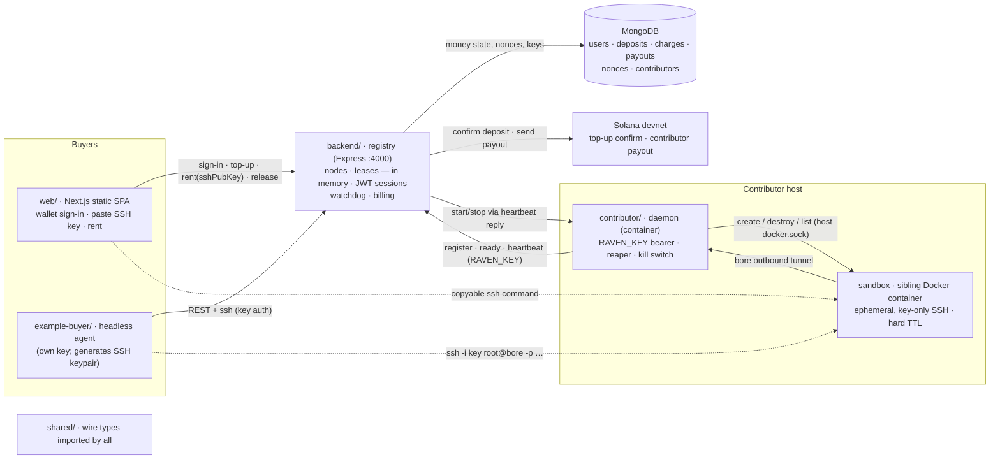

# RAVEN

Rent someone else's machine. Pay by the second, in SOL.

A contributor shares a real machine; a buyer (a human in the web app, or an autonomous agent) rents
it, gets an `ssh` command into a throwaway **Docker container**, and is billed for the exact seconds
used. Solana devnet, custodial balances, no on-chain program required.

## Architecture



**Pieces** — each is a `cd`-able folder; `shared/` holds the types they all import.

| Folder | What it is |
|---|---|
| `backend/` | The registry: REST API, wallet sign-in + JWT sessions, deposit/payout on Solana, contributor-key onboarding, lease lifecycle + billing watchdog. Nodes and leases live in memory; MongoDB holds money state, nonces, and contributor keys. |
| `contributor/` | Runs on each shared machine, itself a container (`docker compose up -d contributor`). `RAVEN_KEY` bearer only (no wallet). Starts each lease as a hardened sibling container on the host Docker daemon and publishes its SSH port over a bore tunnel; a reaper destroys orphans; a local kill switch tears everything down. **Setup: [contributor/README.md](contributor/README.md).** |
| `web/` | Next.js App Router static SPA. Both roles authenticate through a Solana wallet (wallet-standard: Phantom / Solflare / Backpack), and one **Rent / Contribute switch** flips between the two dashboards on the same session — the same wallet can be both. Buyer side (`/`): balance, total lease time, lease count, spend, SSH-key field, node table. Contributor side (`/contributor`): earnings (incl. unsettled), balance, leases given, time given, your nodes, up to two contributor keys, and the copy-paste command to start a node. |
| `example-buyer/` | The buyer flow with no human: an agent that generates an ephemeral SSH keypair, signs in, tops up, rents the cheapest free node, SSHes in with key auth, then releases. |

**Auth (both roles, same flow)**
1. Connect Wallet (wallet-standard: Phantom / Solflare / Backpack — Solana only).
2. `GET /auth/nonce?address=<pubkey>` → single-use nonce (stored in Mongo, 5-min TTL).
3. Sign `Sign in to RAVEN: <nonce>` with the wallet (`signMessage`).
4. `POST /auth/verify {address, signature, role}` → backend verifies with tweetnacl, mints a **JWT** (`SESSION_SECRET`, 24h). Role is which side of the switch you started on and gates nothing — one session serves both dashboards.
- **Buyer:** the JWT authorizes `/wallet/topup` (buyer signs a real SOL transfer to `PLATFORM_PAYTO` in their wallet; backend confirms on-chain and credits their balance) and `/leases` (spends balance, no further signing).
- **Contributor:** the same JWT authorizes `GET /contributor/summary` (earnings + keys + your nodes) and `POST /contributor/keys`, which mints an opaque `rvn_ctb_…` key tied to the verified address in the `contributors` collection — **two per wallet**, so a key can be rolled without stopping the machine already running, and `DELETE /contributor/keys/:key` revokes one. The dashboard shows the key plus the copy-paste `docker compose` command to start a node. The daemon sends only that key as a bearer — the backend resolves it to the payout address server-side, used solely to send the on-chain payout at lease end via `PLATFORM_PRIVATE_KEY`.

**Lease flow**
- **Top up** — the wallet sends SOL to `PLATFORM_PAYTO`; registry confirms the tx on-chain (depositor signed, lamports landed) and credits MongoDB, idempotent by signature.
- **Rent** — `POST /leases` (with your SSH public key) queues a `start` command; the contributor's next heartbeat picks it up, runs the sandbox + bore tunnel, posts `ready`; the lease goes `active` with an `ssh` command.
- **Release / exhaust** — registry bills the exact seconds used (charge in MongoDB), pays the contributor on-chain, and sends a `stop` command that destroys the sandbox.

## The sandbox

Every lease is one **Docker container** on the contributor's machine, started by the daemon through
the host's Docker socket and reachable over an outbound [bore](https://github.com/ekzhang/bore)
tunnel — no inbound ports on the contributor's side.

It is hardened as far as a container goes: no host filesystem mounted, `--cap-drop=ALL`,
`--read-only` root with `noexec,nosuid` scratch tmpfs, `--security-opt no-new-privileges`, capped
CPU/RAM/PIDs, key-only SSH, and a hard self-destruct TTL.

**It shares the contributor's kernel.** That is the boundary's ceiling: a kernel escape from inside a
lease lands on the host, and the daemon's Docker-socket mount is itself host root. Contributors should
run this on a spare machine they're willing to hand to strangers, and buyers shouldn't treat a lease as
a confidential environment. (An earlier revision offered gVisor and Firecracker tiers for exactly this
reason; they were removed in favour of setup that works anywhere Docker does.)

**Contributing a machine? → [contributor/README.md](contributor/README.md).** The whole setup:

```bash
git clone <this repo> raven && cd raven
printf 'RAVEN_KEY=rvn_ctb_…\nREGISTRY_URL=https://api.raven.example\n' > contributor/.env
docker compose up -d --build contributor
```

The `rvn_ctb_…` key comes from the web app's **Contribute** page, which shows this exact command with
your key filled in. The node appears in Explore within ~10s.

## Run it

Each app reads its own `.env` (no root `.env`) — copy the example next to the one you're running.

```bash
npm install

# 1. the registry                                              → :4000
cp backend/.env.example backend/.env   # MONGODB_URI, PLATFORM_PAYTO, PLATFORM_PRIVATE_KEY, SESSION_SECRET
npm run backend

# 2. web UI                                                    → http://localhost:3000
cp web/.env.example web/.env           # NEXT_PUBLIC_REGISTRY_URL (defaults to localhost:4000)
npm run web                            # Buyer at / · "Become a Contributor" at /contributor

# 3. share THIS machine's compute
cp contributor/.env.example contributor/.env   # set RAVEN_KEY (from the Contribute page)
npm run contributor                            # or: docker compose up -d --build contributor

# …or the autonomous buyer agent (its own funded key — signs in, tops up, rents)
cp example-buyer/.env.example example-buyer/.env   # set BUYER_PRIVATE_KEY
npm run client
```

Both roles authenticate the same way: **Connect Wallet → sign a nonce**. No key entry,
no `.env` wallet setup — the buyer additionally signs a real top-up transfer in-browser. The
contributor daemon never touches a wallet; it carries only the `RAVEN_KEY` bearer it was handed.

Each top-level folder is a self-contained piece you can `cd` into: `backend/`, `contributor/`,
`web/`, `example-buyer/`, with `shared/` holding the types they all import.

## Run with Docker

Each piece is its own Compose service, run independently. The backend usually lives on a server; a
contributor runs on each machine sharing compute and points at that backend via `REGISTRY_URL`.

```bash
# each service reads its own <app>/.env — copy the examples first
cp backend/.env.example backend/.env
cp contributor/.env.example contributor/.env
cp example-buyer/.env.example example-buyer/.env
docker compose up -d --build backend         # the registry            → :4000
docker compose --env-file web/.env up -d --build web   # static SPA behind nginx → :3000
docker compose up -d --build contributor     # share THIS machine's compute
docker compose run  --rm   buyer             # one-shot autonomous buyer
```

Run these from the **repo root** — the compose file lives there, not inside each app folder.

The `web` image bakes `NEXT_PUBLIC_*` in at build time (build args). Compose interpolates them from
`--env-file web/.env` (or the shell), so pass `--env-file web/.env` when building the web image.

**Behind https, keep `NEXT_PUBLIC_REGISTRY_URL=/api`** (the compose default). The web image's nginx
reverse-proxies `/api/` to the `backend` service, so the browser only ever talks to the page's own
origin. An absolute URL here is the usual "the UI loads but nothing happens" bug: the bundle is
static, so `http://localhost:4000` means the *visitor's* machine, and any plain-`http` registry URL is
blocked as mixed content on an `https` page — the requests never leave the browser, which is why the
backend log stays silent. Only set an absolute URL when the registry has its own https hostname.

**The `contributor` service mounts the Docker socket** so the daemon can start each lease as a sibling
container on the host's Docker daemon rather than nested inside its own. That mount is equivalent to
host root for anything inside that container — acceptable because the daemon's whole job is driving
Docker, but it's the reason to run a contributor on a dedicated machine. Running it natively
(`npm run contributor`) or under the systemd unit needs no mount at all; see
[contributor/docs/daemon-isolation.md](contributor/docs/daemon-isolation.md).

`backend` keeps only money state in MongoDB (`MONGODB_URI`) — no local volume; set `PLATFORM_PAYTO` +
`PLATFORM_PRIVATE_KEY` too. A contributor needs no inbound ports in the default `TUNNEL_MODE=bore` —
each lease's SSH port is published outbound over bore.

## Web app (Next.js static export)

Next.js App Router with `output: 'export'` — the wallet stack is client-only, so there is no server
to run: `next build` emits a plain static bundle you can host anywhere (the `web` Docker image just
serves it behind nginx).

```bash
NEXT_PUBLIC_REGISTRY_URL=http://your-host:4000 npm run build -w web   # → web/out
```

Drop `web/out` on Vercel / Netlify / Cloudflare Pages / nginx.

## Configuration

There is no root `.env` — each app reads its own: `backend/.env`, `web/.env`, `contributor/.env`,
`example-buyer/.env`. Inline `FOO=bar npm run …` still overrides. The web app's `NEXT_PUBLIC_*` (plus
`MAINNET`) are baked in at build time. See each `<app>/.env.example` for its variables; flip
`MAINNET=true` (backend, web, buyer) to target mainnet-beta instead of devnet.

Contributor knobs are all optional: **`RATE_LAMPORTS_PER_HOUR`** prices the node, **`SHARE_CPUS`** /
**`SHARE_MEM_MB`** size each lease, **`TUNNEL_MODE`** picks bore vs. a same-LAN port, and
**`REAP_INTERVAL_MS`** paces the orphan reaper. SSH is key-only unless the registry sets
`ALLOW_PASSWORD_SSH=true` (off by default).

## Demo script (the money shot)

1. Start the registry, then a contributor (`docker compose up -d --build contributor`).
2. Show the node appear in **Explore** at http://localhost:3000 with its CPU, RAM and price.
3. **Human path:** connect wallet (devnet) → Sign in → Top up (approve one SOL deposit) → paste your
   SSH public key → click **Rent** → a copyable `ssh root@… -p …` command appears with a
   balance-driven countdown. `ssh -i your-key` in. **Release** (or letting the balance hit zero) bills
   the exact time used and destroys the sandbox.
4. **Autonomous path:** run `npm run client` — the agent generates an ephemeral keypair, signs in,
   tops up if low, rents the cheapest free node, runs a tiny training loop over SSH key auth, prints
   the falling loss, then releases.
5. Show the teardown: `docker ps` on the contributor host during the lease lists `raven-<leaseid>` and
   `raven-bore-<leaseid>`; both are gone seconds after release, and the reaper removes any survivor of
   a daemon restart.
6. On a devnet explorer, confirm the top-up and the payout to the contributor; in MongoDB, the single
   `charges` doc (with the billed seconds) and the `payouts` doc.

## What's verified vs. what needs your machine

Compiles + builds clean (full `npm run typecheck`, `npm test`, web static export). Requires your
environment to run end-to-end: a MongoDB database (`MONGODB_URI`), a `SESSION_SECRET`, a Solana
wallet in the browser, a platform account (`PLATFORM_PAYTO` +
`PLATFORM_PRIVATE_KEY`), the Docker sandbox lifecycle (a running Docker daemon), outbound network for
the bore tunnel, an SSH client, and an RPC reachable to confirm top-ups + send payouts (funded devnet
accounts).

## Notes & limitations

- **Custodial model:** top-ups pool at one platform address and balances are an off-chain ledger in
  MongoDB. Top-ups are confirmed on-chain and recorded by signature (the `deposits._id` — idempotent,
  a deposit can't credit twice), and the depositor must have signed the transaction. Contributor earnings are settled
  on-chain on lease end (needs `PLATFORM_PRIVATE_KEY`); if it's unset, payouts are recorded as unpaid
  (`txid` null) instead.
- **Billing:** usage is calculated continuously but charged once, at lease end, prorated at the
  hourly rate (`elapsed/3600 × rate`) — no per-tick debits. A watchdog only checks every
  `METER_INTERVAL_MS` whether the balance is exhausted, so worst-case over-use is one tick.
- **Nodes + leases are in-memory:** a registry restart drops live sessions (the sockets die anyway).
  This is what keeps the DB quiet — heartbeats and the watchdog never write to MongoDB.
- **SSH auth is key-only** by default: the buyer supplies a public key (the web app takes a pasted
  key; the agent generates an ephemeral keypair), the sandbox runs `PasswordAuthentication no` /
  `PermitRootLogin prohibit-password`, and nothing guessable exists on the box. The old
  wallet-address password returns only behind `ALLOW_PASSWORD_SSH=true`, with a startup warning.
- **Isolation is a hardened container, and nothing stronger** (see [The sandbox](#the-sandbox)): no
  host filesystem, `--cap-drop=ALL`, read-only root with `noexec,nosuid` scratch tmpfs,
  `no-new-privileges`, capped CPU/RAM/PIDs, key-only SSH. The kernel is **shared with the contributor's
  host**, so a kernel escape from a lease reaches that host, and the daemon's Docker-socket access is
  host root in its own right. A contributor box should be dedicated and disposable
  (see [contributor/docs/daemon-isolation.md](contributor/docs/daemon-isolation.md)). Egress from a
  lease is **not** filtered; a local kill switch tears every sandbox down at once.
- **Teardown is guaranteed:** the sandbox self-destructs at a hard TTL, and a reaper reconciles live
  containers against known leases every `REAP_INTERVAL_MS`, removing the sandbox and its bore tunnel —
  so a container never outlives the registry.
- **Auth:** both roles connect a Solana wallet and sign a single-use nonce (Mongo, 5-min TTL); verify
  mints a JWT (`SESSION_SECRET`). Spending a balance needs that JWT, so nobody can spend someone
  else's balance. The contributor daemon holds only its `rvn_ctb_…` bearer key — no wallet, no
  signing on the box. `PLATFORM_PRIVATE_KEY` is read only server-side, at payout time; it never
  reaches a response, a log, or the web bundle.
- `web/` is Next.js (App Router) exported as a static bundle (`output: 'export'`): the wallet stack
  is client-only, so every page is a client component and there is no SSR server to run.
