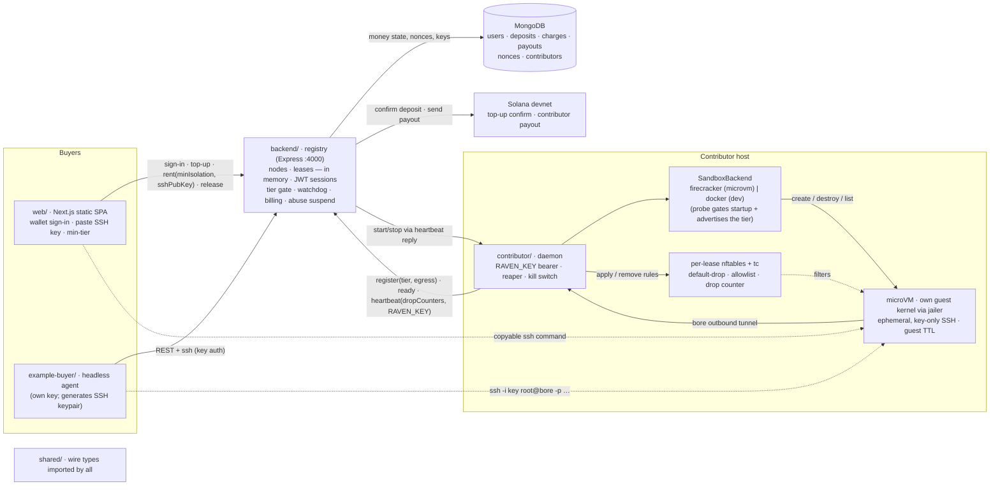

# RAVEN

Rent someone else's machine. Pay by the second, in SOL.

A contributor shares a real machine; a buyer (a human in the web app, or an autonomous agent) rents
it, gets an `ssh` command into a throwaway **Firecracker microVM**, and is billed for the exact seconds
used. Solana devnet, custodial balances, no on-chain program required.

## Architecture



**Pieces** — each is a `cd`-able folder; `shared/` holds the types they all import.

| Folder | What it is |
|---|---|
| `backend/` | The registry: REST API, wallet sign-in + JWT sessions, deposit/payout on Solana, contributor-key onboarding, the isolation-tier gate (`minIsolation`), lease lifecycle + billing watchdog, egress-abuse suspension. Nodes and leases live in memory; MongoDB holds money state, nonces, and contributor keys. |
| `contributor/` | Runs on each shared machine (Linux + `/dev/kvm`, as root). `RAVEN_KEY` bearer only (no wallet). A `SandboxBackend` (`src/sandbox/`, selected by `SANDBOX_BACKEND`) boots each lease as a **Firecracker microVM** under `jailer` and publishes its SSH port over a bore tunnel; a per-lease nftables firewall (`src/net/`) filters egress on the guest's tap; a reaper destroys orphans; a local kill switch tears everything down. `docker` is a local-dev backend only. **Setup guide: [contributor/README.md](contributor/README.md).** |
| `web/` | Next.js App Router static SPA. Both roles authenticate through a Solana wallet (wallet-standard: Phantom / Solflare / Backpack), and one **Rent / Contribute switch** flips between the two dashboards on the same session — the same wallet can be both. Buyer side (`/`): balance, total lease time, lease count, spend, tier badges, SSH-key field, minimum-tier gate ("Below min" on weaker nodes). Contributor side (`/contributor`): earnings (incl. unsettled), balance, leases given, time given, your nodes, and up to two contributor keys. |
| `example-buyer/` | The buyer flow with no human: an agent that generates an ephemeral SSH keypair, signs in, tops up, requests the strongest tier (with explicit fallback), SSHes in with key auth, then releases. |

**Auth (both roles, same flow)**
1. Connect Wallet (wallet-standard: Phantom / Solflare / Backpack — Solana only).
2. `GET /auth/nonce?address=<pubkey>` → single-use nonce (stored in Mongo, 5-min TTL).
3. Sign `Sign in to RAVEN: <nonce>` with the wallet (`signMessage`).
4. `POST /auth/verify {address, signature, role}` → backend verifies with tweetnacl, mints a **JWT** (`SESSION_SECRET`, 24h). Role is which side of the switch you started on and gates nothing — one session serves both dashboards.
- **Buyer:** the JWT authorizes `/wallet/topup` (buyer signs a real SOL transfer to `PLATFORM_PAYTO` in their wallet; backend confirms on-chain and credits their balance) and `/leases` (spends balance, no further signing).
- **Contributor:** the same JWT authorizes `GET /contributor/summary` (earnings + keys + your nodes) and `POST /contributor/keys`, which mints an opaque `rvn_ctb_…` key tied to the verified address in the `contributors` collection — **two per wallet**, so a key can be rolled without stopping the machine already running, and `DELETE /contributor/keys/:key` revokes one. The dashboard shows the key plus a one-line `docker run`. The daemon sends only that key as a bearer — the backend resolves it to the payout address server-side, used solely to send the on-chain payout at lease end via `PLATFORM_PRIVATE_KEY`.

**Lease flow**
- **Top up** — the wallet sends SOL to `PLATFORM_PAYTO`; registry confirms the tx on-chain (depositor signed, lamports landed) and credits MongoDB, idempotent by signature.
- **Rent** — `POST /leases` (with your SSH public key and an optional `minIsolation`) queues a `start` command; the contributor's next heartbeat picks it up, runs the sandbox + bore tunnel, posts `ready`; the lease goes `active` with an `ssh` command.
- **Release / exhaust** — registry bills the exact seconds used (charge in MongoDB), pays the contributor on-chain, and sends a `stop` command that destroys the sandbox.

## Isolation tiers

Isolation is a pluggable, advertised, buyer-selectable property of a node. A node reports the
strongest tier it can actually deliver (`SANDBOX_BACKEND` + a host capability probe at startup); a
buyer sets a minimum on the lease and the registry never places below it. A node never advertises a
tier it can't deliver — if the configured backend is unavailable at startup, the daemon refuses to
register rather than downgrading.

| Tier | `SANDBOX_BACKEND` | Boundary | Needs | Rentable? |
|---|---|---|---|---|
| `microvm` | `firecracker` | own guest kernel under KVM, launched via `jailer` | `/dev/kvm` (bare metal or nested virt) | ✅ **the only rentable tier** |
| `container` | `docker` | shared host kernel, namespaces only | nothing | ❌ local dev only — "Below min" |

**Every rentable lease is a Firecracker microVM.** The marketplace minimum is `microvm`, so a
`container` node registers fine but every row shows *"Below min"* and can't be rented — it exists so
you can develop the flow on a laptop. `SANDBOX_BACKEND=firecracker` is the default.

**Contributing a machine? → [contributor/README.md](contributor/README.md)** — requirements first,
then step-by-step: get your key → set up Firecracker → configure → run → verify it's rentable.

One command sets up a host, then the daemon runs natively (it needs root for tap + loop-mount):

```bash
sudo bash contributor/scripts/setup-firecracker.sh   # firecracker + jailer, guest kernel, dirs, NAT
sudo -E npm run contributor                          # contributor/.env: RAVEN_KEY, REGISTRY_URL
```

**The hard requirement is `/dev/kvm`** — bare metal or a nested-virt instance (Hetzner/OVH dedicated,
AWS EC2 `*.metal`, GCP with nested virt). macOS, Apple silicon under Colima, and standard DigitalOcean
droplets do **not** expose KVM; the registry, MongoDB and the web app run fine on an ordinary droplet,
only the contributor daemon needs it. Check any host with
`bash contributor/scripts/preflight-microvm.sh`, and see
[contributor/docs/microvm-setup.md](contributor/docs/microvm-setup.md). The Firecracker path compiles
and is checked by that preflight, but it is verified only by hand on a KVM host — not in CI.

## Run it

Each app reads its own `.env` (no root `.env`) — copy the example next to the one you're running.

```bash
npm install

# 1. the registry                                              → :4000
cp backend/.env.example backend/.env   # MONGODB_URI, PLATFORM_PAYTO, PLATFORM_PRIVATE_KEY, SESSION_SECRET
npm run backend

# 2. web UI                                                    → http://localhost:3000
cp web/.env.example web/.env           # NEXT_PUBLIC_REGISTRY_URL (defaults to localhost:4000)
npm run web                            # Buyer at / · "Become a Contributor" at /contributor

# 3. share THIS machine's compute — needs a Linux host with /dev/kvm, or the node isn't rentable
sudo bash contributor/scripts/setup-firecracker.sh  # one-time: firecracker, jailer, guest kernel, NAT
cp contributor/.env.example contributor/.env        # set RAVEN_KEY (from the Contribute page)
sudo -E npm run contributor                         # full guide: contributor/README.md

# …or the autonomous buyer agent (its own funded key — signs in, tops up, rents)
cp example-buyer/.env.example example-buyer/.env   # set BUYER_PRIVATE_KEY
npm run client
```

Both roles authenticate the same way: **Connect Wallet → sign a nonce**. No key entry,
no `.env` wallet setup — the buyer additionally signs a real top-up transfer in-browser. The
contributor daemon never touches a wallet; it carries only the `RAVEN_KEY` bearer it was handed.

Each top-level folder is a self-contained piece you can `cd` into: `backend/`, `contributor/`,
`web/`, `example-buyer/`, with `shared/` holding the types they all import.

## Run with Docker

The registry, web app and buyer agent each have their own Compose service. **The contributor does
not** — see below.

```bash
# each service reads its own <app>/.env — copy the examples first
cp backend/.env.example backend/.env
cp example-buyer/.env.example example-buyer/.env
docker compose up --build backend        # run the backend / registry  → :4000
docker compose --env-file web/.env up --build web   # static SPA behind nginx → :3000
docker compose run  --rm   buyer         # one-shot autonomous buyer
```

Run these from the **repo root** — the compose file lives there, not inside each app folder.

The `web` image bakes `NEXT_PUBLIC_*` in at build time (build args). Compose interpolates them from
`--env-file web/.env` (or the shell), so pass `--env-file web/.env` when building the web image.

**No `contributor` service, deliberately.** The daemon delivers the microVM tier with Firecracker,
which needs `/dev/kvm`, root-level tap networking, and host binaries the image doesn't carry. Making it
work in a container would take `--privileged` plus the Docker socket — full host root, which is exactly
what the isolation is meant to prevent. Contributors run it natively
(`sudo -E npm run contributor`, or the systemd unit); see
[contributor/docs/daemon-isolation.md](contributor/docs/daemon-isolation.md). `contributor/Dockerfile`
remains for the local-dev `container` tier only.

`backend` keeps only money state in MongoDB (`MONGODB_URI`) — no local volume; set `PLATFORM_PAYTO` +
`PLATFORM_PRIVATE_KEY` too. A contributor needs no inbound ports in the default `TUNNEL_MODE=bore` —
each lease's SSH port is published outbound over bore.

## Web app (Next.js static export)

Next.js App Router with `output: 'export'` — the wallet stack is client-only, so there is no server
to run: `next build` emits a plain static bundle you can host anywhere (the `web` Docker image just
serves it behind nginx).

```bash
NEXT_PUBLIC_REGISTRY_URL=http://your-host:4000 npm run build -w web   # → web/out
```

Drop `web/out` on Vercel / Netlify / Cloudflare Pages / nginx.

## Configuration

There is no root `.env` — each app reads its own: `backend/.env`, `web/.env`, `contributor/.env`,
`example-buyer/.env`. Inline `FOO=bar npm run …` still overrides. The web app's `NEXT_PUBLIC_*` (plus
`MAINNET`) are baked in at build time. See each `<app>/.env.example` for its variables; flip
`MAINNET=true` (backend, web, buyer) to target mainnet-beta instead of devnet.

Isolation + egress are contributor knobs: **`SANDBOX_BACKEND`** picks the tier (`firecracker` default =
`microvm`, rentable; `docker` = `container`, local dev only) and the daemon fails to start if that
backend's host requirements aren't met. The `FC_*` vars move the guest kernel, rootfs cache, network
slots and jailer chroot. **`EGRESS_MODE`** (`allowlist` default / `deny-all` / `open`) is applied per
lease and advertised on the node, so buyers see it before renting. SSH is key-only unless the registry
sets `ALLOW_PASSWORD_SSH=true` (off by default).

## Demo script (the money shot)

1. Start the registry, then two contributors — one `firecracker` on a KVM host (after
   `setup-firecracker.sh`) and one `docker` anywhere, to show the gate working in both directions.
2. Show the nodes appear in **Explore** at http://localhost:3000 with their isolation + egress
   badges: the `microVM` node's **Rent** button is live, the `container` node's reads **"Below min"**
   — the registry would reject it too (409 with the tiers it *can* place on).
3. **Human path:** connect wallet (devnet) → Sign in → Top up (approve one SOL deposit) → paste your
   SSH public key → click **Rent** → a copyable `ssh root@… -p …` command appears with a
   balance-driven countdown. `ssh -i your-key` in. **Release** (or letting the balance hit zero) bills
   the exact time used and destroys the sandbox.
4. **Autonomous path:** run `npm run client` — the agent generates an ephemeral keypair, signs in,
   tops up if low, requests the `microvm` tier (logging an explicit fallback if none offers it), runs
   a tiny training loop over SSH key auth, prints the falling loss, then releases.
5. Show the boundary: during a lease, `uname -a` + `dmesg | head` inside it show a **guest** kernel,
   while on the host `ps aux | grep firecracker` shows the VMM jailed under uid 30000 and `ip link`
   shows that lease's own `rvn<n>` tap.
6. Show egress enforcement: from inside a sandbox, `curl https://not-allowlisted.example` hangs/drops
   while an allowlisted host works; the drop shows up in the per-lease `nft` counter the daemon
   reports on heartbeat.
7. On a devnet explorer, confirm the top-up and the payout to the contributor; in MongoDB, the single
   `charges` doc (with the billed seconds) and the `payouts` doc.

## What's verified vs. what needs your machine

Compiles + builds clean (full `npm run typecheck`, `npm test`, web static export). Requires your
environment to run end-to-end: a MongoDB database (`MONGODB_URI`), a `SESSION_SECRET`, a Solana
wallet in the browser, a platform account (`PLATFORM_PAYTO` +
`PLATFORM_PRIVATE_KEY`), the Docker sandbox lifecycle (a running Docker daemon), outbound network for
the bore tunnel, an SSH client, and an RPC reachable to confirm top-ups + send payouts (funded devnet
accounts).

## Notes & limitations

- **Custodial model:** top-ups pool at one platform address and balances are an off-chain ledger in
  MongoDB. Top-ups are confirmed on-chain and recorded by signature (the `deposits._id` — idempotent,
  a deposit can't credit twice), and the depositor must have signed the transaction. Contributor earnings are settled
  on-chain on lease end (needs `PLATFORM_PRIVATE_KEY`); if it's unset, payouts are recorded as unpaid
  (`txid` null) instead.
- **Billing:** usage is calculated continuously but charged once, at lease end, prorated at the
  hourly rate (`elapsed/3600 × rate`) — no per-tick debits. A watchdog only checks every
  `METER_INTERVAL_MS` whether the balance is exhausted, so worst-case over-use is one tick.
- **Nodes + leases are in-memory:** a registry restart drops live sessions (the sockets die anyway).
  This is what keeps the DB quiet — heartbeats and the watchdog never write to MongoDB.
- **SSH auth is key-only** by default: the buyer supplies a public key (the web app takes a pasted
  key; the agent generates an ephemeral keypair), the sandbox runs `PasswordAuthentication no` /
  `PermitRootLogin prohibit-password`, and nothing guessable exists on the box. The old
  wallet-address password returns only behind `ALLOW_PASSWORD_SSH=true`, with a startup warning.
- **Isolation is a Firecracker microVM** (see the table above): its own guest kernel under KVM, started
  through `jailer` (chroot, uid/gid 30000, cgroup slice), with a per-lease `/30` tap and no host
  filesystem passed in. The SSH key is injected into a per-lease *copy* of the cached rootfs, so it can
  never reach the next lease. A node advertises only what it can deliver and the registry never places a
  lease below the buyer's `minIsolation`. The daemon itself runs as **root** on the contributor host —
  treat that box as dedicated
  (see [contributor/docs/daemon-isolation.md](contributor/docs/daemon-isolation.md)).
- **Egress is filtered per lease** (`EGRESS_MODE`, default `allowlist`): default-drop outbound, DNS to
  the resolver only, the buyer's allowlist, and drops of cloud metadata + RFC1918, enforced with
  nftables on that lease's tap. A buyer whose lease slams the firewall past `EGRESS_DROP_LIMIT` is
  suspended; a local kill switch tears every sandbox down at once. (The `container` dev tier has no
  filterable tap, so it logs that egress is unenforced — it isn't rentable anyway.)
- **Teardown is guaranteed:** the guest powers itself off at a hard TTL, and a host reaper reconciles
  live VMs against known leases every `REAP_INTERVAL_MS`, removing the tap, network slot, jail and
  firewall — so a VM never outlives the registry.
- **Auth:** both roles connect a Solana wallet and sign a single-use nonce (Mongo, 5-min TTL); verify
  mints a JWT (`SESSION_SECRET`). Spending a balance needs that JWT, so nobody can spend someone
  else's balance. The contributor daemon holds only its `rvn_ctb_…` bearer key — no wallet, no
  signing on the box. `PLATFORM_PRIVATE_KEY` is read only server-side, at payout time; it never
  reaches a response, a log, or the web bundle.
- `web/` is Next.js (App Router) exported as a static bundle (`output: 'export'`): the wallet stack
  is client-only, so every page is a client component and there is no SSR server to run.
